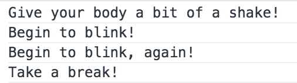
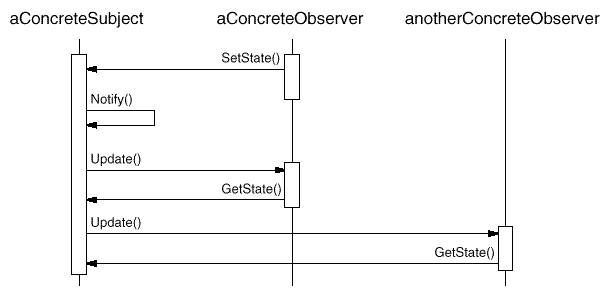

# 事件模型

我们在使用 ExtJS 时，经常会为某组件绑定事件，以做相应扩展处理。
创建组件时通过配置 `listeners` 属性即可绑定事件：

```js
var i = 0;
var btn = Ext.create('Ext.button.Button', {
	text: 'Button',
	listeners: {
		mouseover: function (btn) {
			console.log(btn.getText() + ++i);
		}
	},
	renderTo: document.body
});
```

也可以通过 `on` 方法给组件实例绑定事件：

```js
btn.on('click', function () {
	alert('clicked');
});
```

以上方法已经能解决我们使用 ExtJS 事件时绝大多数需求。
然而当我们扩展或自定义一个组件时，常常需要注册自定义的事件并在合适的时机触发它们。
这一章要讲的事件模型分为三部分，以上为其一 —— 绑定：

* 注册
* 触发
* 绑定

来看一个较为完整的示例：

```js
Ext.define('MyButton', {
    extend: 'Ext.button.Button',

    initComponent: function () {
        this.callParent();
        this.addEvents('blink');  // <------ 注册
    },

    shake: function () {
        console.log('Give your body a bit of a shake!');
        this.fireEvent('blink', this); // <------ 触发
        console.log('Take a break!');
    }

});

var mybtn = Ext.create('MyButton');

// <------ 绑定
mybtn.on('blink', function () {
    console.log('Begin to blink!');
});
mybtn.on('blink', function () {
    console.log('Begin to blink, again!');
});

mybtn.shake();
```

执行结果如下：



从代码中可以看出，对于 `shake` 方法只需要在合适的时机触发 `blink` 事件，
它不需要知道有谁绑定了该事件，也不关心事件的执行过程，从而将 `blink`
这一特定行为从 `shake` 中解耦。


## 观察者模式

理解 ExtJS 的事件机制，需要先了解 **观察者模式**。该模式维护了一个对象(subject)
与其观察者(observer)之间的一对多关系，当对象状态变化时，会自动通知并更新观察者。


一个对象和两个观察者调用关系时序图如下：



剥离出精简的代码实现示例：

```js
function Subject() {
	this.observers = [];
}
Subject.prototype = {
    addObserver: function (ob) {
    	this.observers.push(ob);
    },
    removeObserver: function () {
    	// remove...
    },
    notify: function () {
    	var i = 0, len = this.observers.length;
    	for (; i < len; ++i) {
    		this.observers[i].update();
    	}
    }
    // ...
};

function Observer(name) {
	this.name = name;
	this.update = function () {
		console.log(this.name + ' was updated!');
	}
}

var zs = new Observer('zhangsan');
var ls = new Observer('lisi');

var subject = new Subject();
subject.addObserver(zs);
subject.addObserver(ls);
subject.notify();
```

关于观察者模式的书籍、网络资源极其丰富，请参考相应介绍。


## 订阅/发布模式

## 备注

* `handler` 不是事件。ExtJS中配置的 `handler` 只是一个方法调用，不进行事件绑定。
* `

