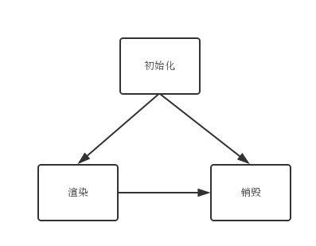

# 组件生命周期

ExtJS 的组件生命周期分为三个阶段：

* 初始化
* 渲染
* 销毁

准确理解组件的生命周期过程，是正确使用 ExtJS 框架的基础。
尤其当你需要编写 ExtJS 的插件或对其做其它扩展时，
更应该知道组件详细的生命周期过程。



从图中可以看出，ExtJS 的组件始于**初始化**终于**销毁**，
而且组件未必需要经过**渲染**即可进入销毁阶段。不同版本的
ExtJS 处理的细节必然不尽相同，我很难告诉你一个永远正确的、
详实的生命周期过程，因此我以 4.2 版本为蓝本讨论其生命周期中具体的处理过程，
希望给你一个方向性的指引，而你应该根据手中具体的版本结合API文档，
甚至是源代码来确定生命周期过程中的每一个细节。值得庆幸的是，
我在 ExtJS 3.4/4.2/5.1 三个版本中，都没有发现其生命周期有很大的变动。

另一件值得补充的事是，我在实践中发现有不少人知道 “ExtJS 存在生命周期”
这么一回儿事，然而并不清楚这和自己的代码有什么关系。我想在正式讲解前告诉你，
当你 `Ext.create` (或 `new`) 一个组件时，它的生命周期过程就会开始，例如：

```js
Ext.create('Ext.grid.Panel', {
    title: 'MyPanel',
    height: 200,
    width: 400,
    store: ...,
    columns: ...
});
```

我们创建了一个 ExtJS 的列表组件，此时它会完成生命周期中的 “初始化”
阶段，当我们在浏览器中执行以上代码时并没有看到列表页面，因为组件还没有渲染。
如果我们配置了 `renderTo` 属性，则它会在初始化后直接进入渲染阶段。

你在无意中操作生命周期的情况也有很多，又如，
通过调用 `add` 方法给 toolbar 组件增加新的按钮：

```js
toolbar.add([
    {text: 'Button 1'},
    {text: 'Button 2'}
]);
```

这一过程通常也会经过“初始化”和“渲染”阶段。我们只是传入了一个极其普通的
JavaScript 对象，ExtJS 框架内部会帮我们创建、初始化 `Button`
对象并将其渲染到相应容器(此例为 `toolbar`)中。如果你想自己完成初始化操作，
可以这样：

```js
var anothorBtn = Ext.create('Ext.button.Button', {
    text: 'MyButton'
});
toobar.add(anothorBtn);
```

两种方式稍有区别，后者可能会过早地创建一个也许永远用不着的组件。
关于此问题的详细内容我们将在《组件模型》中介绍。
现在来看看具体的生命周期过程:


## 初始化

初始化是组件开始构建的起点，你可以粗略地认为，本阶段仅是创建
JavaScript 对象的过程，也正因此初始化可能是执行速度最快的。
这一阶段会进行必要的配置信息处理、注册一些基础事件，甚至会做预渲染工作。

### 1.配置应用

优先处理参数中传入的配置信息。通常这一过程只是把配置对象复制到想要创建的
ExtJS 组件中以备后续使用。`initialConfig` 中保存着你传入的原始参数。
代码实现看起来是这样的：

```js
if (config) {
    Ext.apply(this, config);
} else {
    config = {};
}
this.initialConfig = config;
```

### 2.注册事件

之后会注册监听事件，注意是 **注册** 而非触发或绑定事件。具体的事件机制我们将在
《事件模型》中详细讲解。事件注册过程就像变量声明，只是声称当前组件有哪些事件，
此时应该在文档中描述清楚这些事件何时会触发。ExtJS 提供了注册事件的方法，非常方便：

```js
this.addEvents('activate');
```

### 3.生成ID

如果你通过参数传入了 id 则使用传入的，否则将会生成新的。ExtJS 的代码实现非常有趣，
我在 ExtJS 2.2 版本中初次见到这个方法时，就觉得它是个不错的 JS 技巧，直到现在
ExtJS 还在使用它，来欣赏一下：

```js
getId: function () {
    return this.id || (this.id = 'ext-comp-' + (this.getAutoId()));
}
```

插句题外话。我建议应用中除了公共的、使用频率极高的组件，尽量不要明确指定 id ，
毕竟 id 最终会被用来生成 html 标签的 id 属性。此时重复的 id 将导致不可预知的后果。
如果你希望在某组件中快速地找到子组件，使用 `itemId` ！

### 4.实例化插件

插件的实例化过程是早于 `initComponet` 的，以便于像 gridpanel 的 `editing`
这类插件提前处理 editor 等。

### 5.initComponent

使用过 ExtJS 的人都知道这个方法。`initComponent` 方法的设计动机是给子类一个切入点，
使其可以友好地参与父类的初始化过程。在方法中你可以：注册子类特有的事件，创建对 store
的引用，创建并实例化子组件等。通常你只需要覆盖并实现此方法来扩展某组件的初始化过程即可。

### 6.组件注册到 ComponentManager 中

此步会将组件注册到 ComponentManager 中，它是 ExtJS 的组件管理器，当你调用

```js
Ext.getCmp('foo');
```

时，实际上正是从组件管理器中找到对应组件。关于 ComponentManager 详细的介绍可以阅读API文档，
唯一需要提醒你注意的是，不要使用重复 id ! 后注册的相同 id 的组件会覆盖之前的。

### 7.增加 observable 和 state

`observable` 为组件提供事件注册、触发及监听绑定的能力；`state` 为组件提供状态信息，
如用户拖动的表格列宽、当前打开的标签页等。ExtJS 在生命周期过程中通过
mixin 的方式掺和了这两个能力，换言之，如果我们扩展的组件继承自 ExtJS 的任意一个组件，
我们不需要显式地重复调用此二者。因为 ExtJS 已经为我们调用了：

```js
this.mixins.observable.constructor.call(this);
this.mixins.state.constructor.call(this, config);
```

### 8.注册状态事件 resize

在上一步骤中注入了 state 能力，然后为组件绑定 resize 事件，以便组件随容器自动改变大小。
这一步骤是 ExtJS 所有组件能够完全屏幕自适应的基础。

### 9.初始化插件

也就是调用插件的 `init` 方法。在之前的步骤中已经实例化了所需插件，此步骤调用并执行插件。

### 10.处理 ComponentLoader

`ComponentLoader` 提供了一种可能：通过Ajax传回的内容构造组件。详细使用参考API文档。

### 11.进入渲染阶段

如果指定了 `renderTo` 属性，则继续渲染组件，否则则等待用户调用渲染方法，
或通过父容器调用渲染方法。

如果是 “非容器内” 组件且配置了 `autoshow` 属性，则 `show` 组件。


## 渲染
